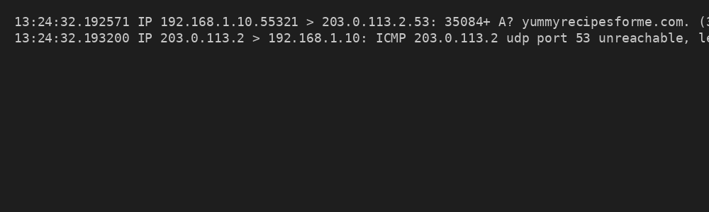
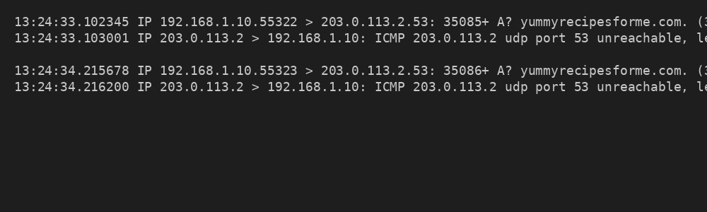
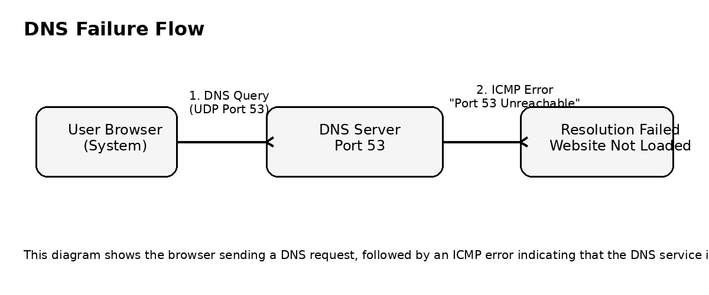

# Network Traffic Analysis

## Scenario
Analyzed DNS failure using tcpdump.

## Tools Used
- `tcpdump`
- Basic DNS and ICMP analysis
- Network troubleshooting methodology

## Findings
ICMP error showed port 53 unreachable.

## Security Impact
DNS failure caused service disruption.

## Visual Evidence

## Report File

[Download the full report](./Network Traffic Analysis-Cybersecurity incident report.docx)
