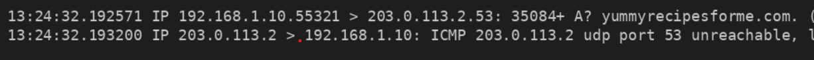
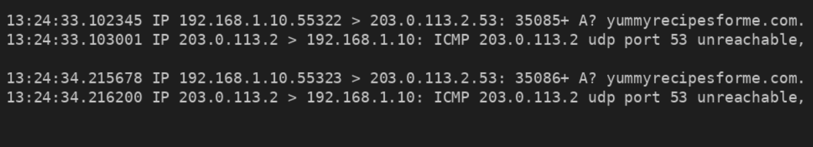

# Network Traffic Analysis

## Scenario
Users reported that they could not access the website `yummyrecipesforme.com`.  
Instead of loading the page, they received the error message: **destination port unreachable**.

As a security analyst, I used `tcpdump` to capture and review the network traffic in order to identify the root cause of the issue.

---

## Analysis

The traffic showed that the system was sending DNS requests over **UDP port 53** to resolve the website domain.

Instead of receiving a normal DNS response, the system received **ICMP error messages** saying that **UDP port 53 was unreachable**.

This indicates that the DNS server could not be reached properly, so the domain name could not be resolved.

---

## Findings

The packet analysis confirmed:

- repeated UDP DNS requests
- repeated ICMP responses
- failure to resolve the domain name
- disruption of website access

This points to a **DNS-related service issue**.

---

## Possible Cause

The most likely causes are:

- DNS server failure
- firewall blocking traffic on port 53
- DNS misconfiguration
- possible denial-of-service impact on the DNS service

---

## Security Impact

The DNS failure prevented users from accessing the website, causing service disruption and affecting availability.

---

## Visual Evidence

### Figure 1: DNS request followed by ICMP error


This shows that the system sent a DNS request, but the server responded with an ICMP error instead of a valid DNS reply.

---

### Figure 2: Repeated DNS failures


This confirms that the problem was not a one-time error and that the DNS failure was persistent.

---

## Flow Diagram

```text
User System (Browser)
       |
       |  1. DNS Request (UDP 53)
       v
DNS Server
       |
       |  2. ICMP Response – Port 53 Unreachable
       v
Resolution Failed
Website Not Loaded
