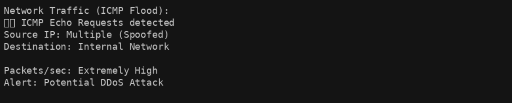
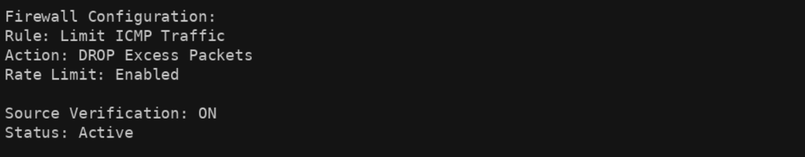

# NIST Incident Response Analysis (ICMP Flood Attack)

## Scenario
A multimedia company experienced a network outage caused by a denial-of-service (DoS) attack.

The attack flooded the network with ICMP packets, making all services unavailable for about two hours. The issue was caused by a misconfigured firewall that allowed excessive ICMP traffic.

The security team responded by blocking ICMP traffic and restoring critical systems.

---

## Summary

The organization faced a network outage due to an ICMP flood attack.  
The attack overwhelmed the network and disrupted all services.

The issue was mitigated by restricting ICMP traffic and prioritizing essential systems.

---

## NIST Analysis

### Identify
- The attack was a DDoS using ICMP flooding  
- The entire network was affected  
- Critical services became unavailable  

**Security Impact:** Critical network services were disrupted, leading to loss of access.

---

### Protect
- Firewall rules were updated to limit ICMP traffic  
- IDS/IPS controls were introduced  

**Security Impact:** Improved controls reduce the likelihood of future attacks.

---

### Detect
- Monitoring tools were enabled to detect abnormal traffic  
- Firewall checks were added for suspicious packets  

**Security Impact:** Faster detection helps reduce downtime.

---

### Respond
- Malicious traffic was blocked  
- Non-critical systems were shut down  

**Security Impact:** Quick response limits damage and restores stability.

---

### Recover
- Critical systems were restored first  
- Full services resumed after traffic stabilized  

**Security Impact:** Structured recovery reduces business disruption.

---

## Security Impact (Overall)

The attack caused a **complete network outage**, affecting service availability and business operations.

---

## Visual Evidence

### Figure 1: ICMP Flood Traffic

This shows a high volume of ICMP packets indicating a DDoS attack.

---

### Figure 2: Firewall Rule Mitigation

This shows how ICMP traffic was controlled to stop the attack.

---

### Figure 3: DDoS Attack Flow

This illustrates how attackers flooded the network and caused service disruption.

---

## Report File

[Download Full Report](./NIST incident report analysis.docx)

---

## Key Takeaways

- ICMP flood attacks can disrupt entire networks  
- Misconfigured firewalls can increase vulnerability  
- Monitoring and detection are critical for early response  
- Proper response and recovery reduce business impact 
