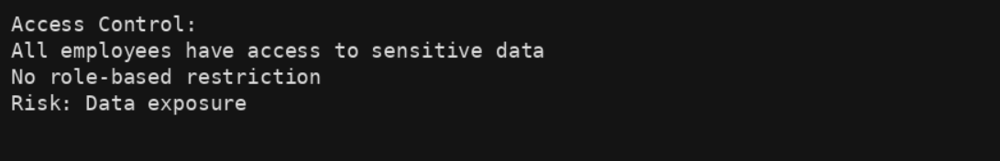
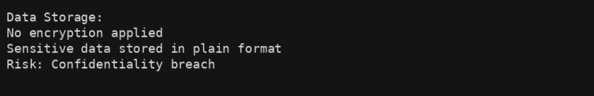
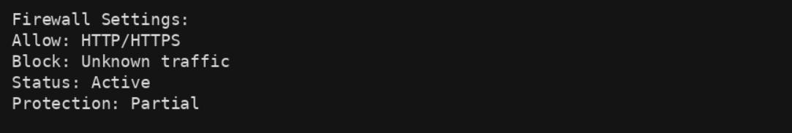
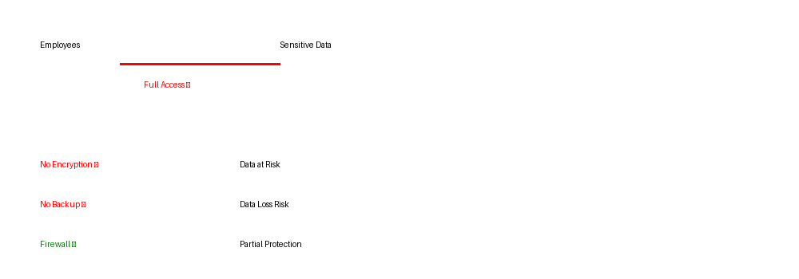

# Security Risk Assessment – Botium Toys (GRC)

## Scenario
Botium Toys is a growing company with multiple systems, employees, and customer data.  
However, the organization has weak security controls and is not fully compliant with standards like PCI DSS and GDPR.

Employees have broad access to sensitive data, encryption is not used, and there are no proper backup or recovery systems.

The goal is to assess the current security posture, identify risks, and recommend improvements.

---

## Analysis

The assessment identified several major security gaps:

- No access control (all employees have full access)
- No encryption for sensitive customer data
- No backups or disaster recovery plan
- Weak password policies
- No intrusion detection system (IDS)

Some controls are present:
- Firewall is active
- Antivirus is installed
- Physical security (locks, CCTV) is in place

---

## Findings

The organization has **multiple critical control failures**, especially in:

- Access management (no least privilege)
- Data protection (no encryption)
- Availability (no backup/recovery)
- Monitoring (no IDS)

These gaps increase the likelihood of:
- Data breaches
- Unauthorized access
- Business disruption

---

## Security Impact

The lack of proper controls increases the risk of **data exposure, system compromise, and operational downtime**, making the organization highly vulnerable to cyber threats.

---

## Visual Evidence

### Figure 1: Access Control Issue

This highlights a critical control gap in access management, increasing the risk of unauthorized data access.

---

### Figure 2: Encryption Missing

This shows a lack of data protection controls, making sensitive information vulnerable to exposure.

---

### Figure 3: Firewall Configuration

This indicates that while basic network protection exists, it is not sufficient to fully secure the system.

---

### Figure 4: Risk Exposure Overview

This summarizes key security weaknesses and shows how multiple gaps contribute to overall high risk.

---

## Compliance Impact

### PCI DSS
- No encryption of payment data  
- Excessive access to sensitive information  
- Weak password controls  

### GDPR
- Sensitive data is not properly protected  
- Data classification is incomplete  

### SOC
- Weak access control policies  
- Lack of confidentiality controls  

---

## Recommendations

To improve security posture, the organization should:

- Implement **least privilege access control**
- Enable **encryption for sensitive data**
- Set up **backup and disaster recovery systems**
- Enforce **strong password policies**
- Deploy an **intrusion detection system (IDS)**
- Improve **asset classification and monitoring**
