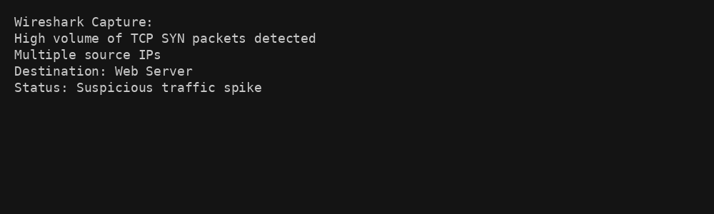
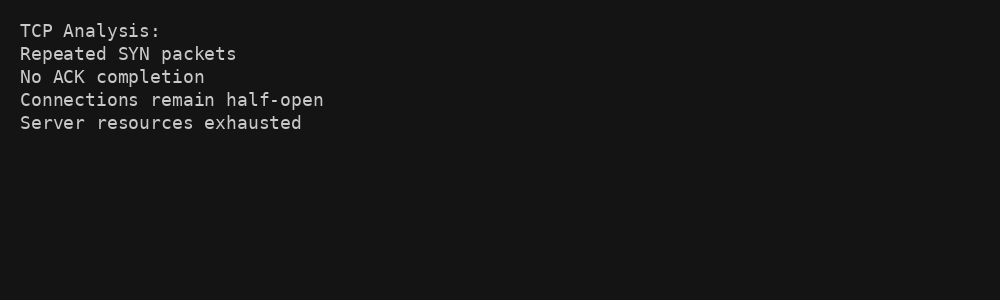
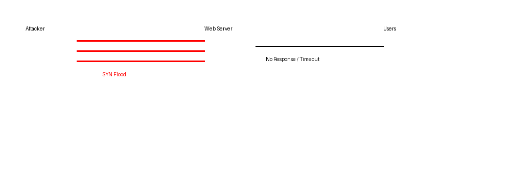

# SYN Flood Attack Analysis - Wireshark

## Scenario
A website became unavailable due to repeated TCP SYN requests that overloaded the server.

## Analysis
The traffic showed many SYN packets without completed handshakes.

## Findings
This pattern is consistent with a SYN flood attack.

## Security Impact
The attack caused server resource exhaustion, preventing legitimate users from accessing the website.

## Visual Evidence

### Figure 1: High volume of SYN packets

This highlights abnormal TCP traffic indicating a potential SYN flood attack.

---

### Figure 2: Half-open TCP connections

This shows incomplete connections consuming server resources.

---

### Figure 3: SYN Flood Attack Flow

